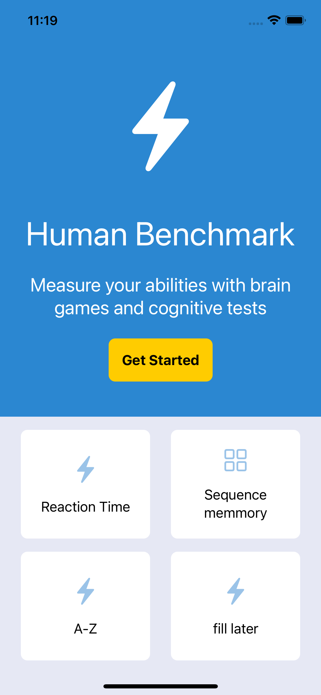

# Benchmark

Playing with SwiftUI and trying to make a prototype of www.humanbenchmark.com in app format to learn new things

Currently working:
* Reaction test
* A-Z speed typing

Not working: 
* Sequence Memmory
* Number memmory

    

 
